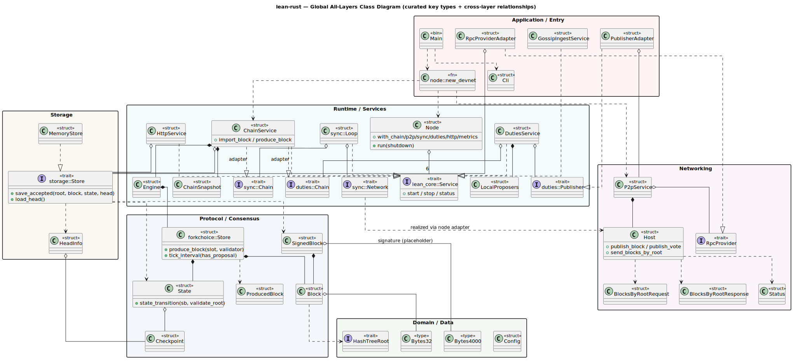

# Global All-Layers Class Diagram

A single consolidated view of the key types across every layer and the
**cross-layer relationships** between them — port realizations, adapters,
composition, and how core data types thread through the stack. For the full
field/method detail of any one layer, see its [per-layer page](README.md#layout);
for the crate-level dependency overview, see [`global-class.md`](global-class.md).

Source: [`diagrams/all-layers-class.puml`](diagrams/all-layers-class.puml).

## How to read it

- Each colored package is a layer (matching the per-layer pages); inside are the
  2–4 load-bearing types per crate — not every field/method (those live on the
  per-layer pages).
- Edge styles:
  - `..>` dashed — uses / depends on.
  - `..|>` hollow triangle — trait realization (e.g. `MemoryStore` realizes
    `storage::Store`; `ChainService` realizes the `sync::Chain` and
    `duties::Chain` ports via adapters).
  - `*--` / `o--` — composition / aggregation (e.g. `Engine` owns a
    `forkchoice::Store`; `Node` aggregates six `Service` impls).

## Tracing a block through the layers

1. **Domain** — `Block` is built from `Bytes32` roots and implements
   `HashTreeRoot`; `SignedBlock` wraps it with a (placeholder) `Bytes4000`
   signature.
2. **Protocol** — `State::state_transition` applies a `SignedBlock`;
   `forkchoice::Store` tracks blocks and produces new ones (`ProducedBlock`).
3. **Storage** — `storage::Store::save_accepted` persists the `SignedBlock`,
   post-`State`, and `HeadInfo`.
4. **Runtime** — `ChainService` composes `Engine` (over `forkchoice::Store`) and
   `storage::Store`; it realizes the `sync::Chain` and `duties::Chain` ports.
   `sync::Loop` imports peer blocks; `DutiesService` produces and publishes them.
5. **Networking** — `Host` carries `BlocksByRootRequest`/`Response` and gossips
   blocks/votes; `RpcProvider` answers block queries.
6. **Application** — `node::new_devnet` wires all services into `core::Node`;
   `PublisherAdapter` and `RpcProviderAdapter` bridge runtime ports to the p2p
   host and storage.
