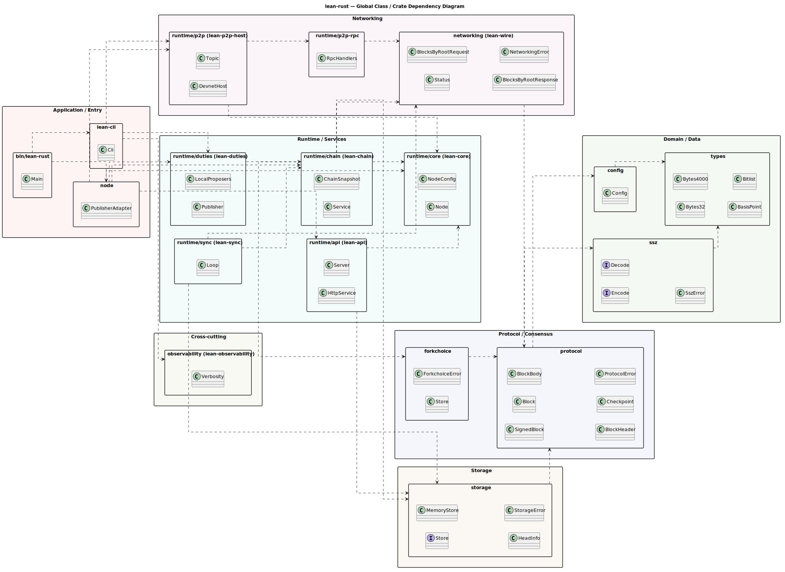

# Global Class / Crate-Dependency Diagram

A top-level view of every lean-rust crate, grouped by layer, with the primary
aggregate type each crate exposes and the direct cross-crate dependency edges.
Per-layer pages drill into exhaustive class detail.

Source: [`diagrams/global-class.puml`](diagrams/global-class.puml).

## Reading the diagram

- Each package is a workspace crate; the box title is its directory path and,
  where it differs, the Cargo package name in parentheses.
- Dashed arrows are `depends-on` edges (`A ..> B` means crate `A` depends on
  crate `B`). Only **direct** dependencies are drawn; transitive edges are
  omitted so the layering stays legible.
- Colors group crates into the layers described in
  [`README.md`](README.md#layer-map).

## Key observations

- `types` is the root of the graph — it depends on nothing else in the
  workspace.
- `ssz`, `config`, and `protocol` build the domain and protocol layers directly
  on `types`.
- `runtime/chain` (lean-chain) is the integration hub of the runtime layer,
  composing `runtime/core`, `storage`, `forkchoice`, and `networking`.
- `node` wires the runtime services together; `bin/lean-rust` is the thin entry
  point over `lean-cli` and `node`.
