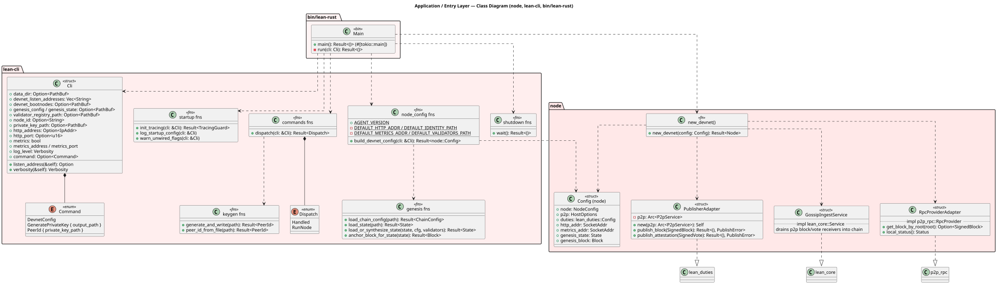
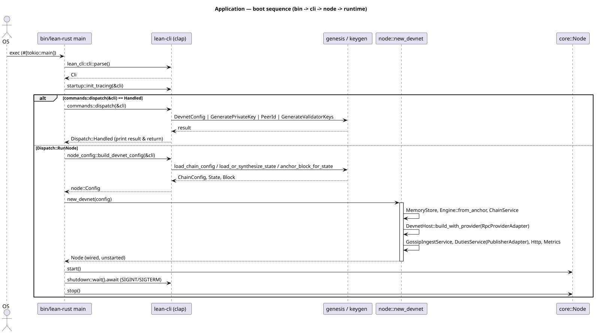

# Application / Entry Layer

Crates: `node` (composition root), `lean-cli` (argument parsing, subcommands,
and the CLI-to-node boot wiring), `bin/lean-rust` (binary entry point).

## Class diagram

Source: [`application-class.puml`](../diagrams/application-class.puml).

- **`bin/lean-rust`** — `main` (`#[tokio::main]`) and the `run` boot
  routine, which delegates every step to `lean-cli`. Two functions, no
  constants, no tests.
- **`lean-cli`** — the `Cli` flag struct and `Command` subcommand enum, the
  `genesis` / `keygen` helpers, and the boot wiring itself: `startup`
  (tracing + startup log), `commands` (subcommand dispatch), `node_config`
  (`build_devnet_config` and the default-address constants), and `shutdown`
  (signal handling).
- **`node`** — the node `Config` (wiring inputs), `new_devnet` (composition
  root), and the adapters that bridge ports to implementations:
  `PublisherAdapter` (duties `Publisher` → p2p), `RpcProviderAdapter` (p2p RPC →
  storage), `GossipIngestService` (p2p receivers → chain).

## Sequence — boot

Source: [`application-seq-boot.puml`](../diagrams/application-seq-boot.puml).

`main` parses the CLI, initializes tracing, and either runs a subcommand and
exits or builds the devnet config, calls `new_devnet` to wire all services, then
starts the node and waits for a shutdown signal before stopping it.
