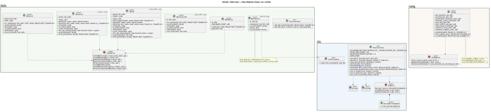
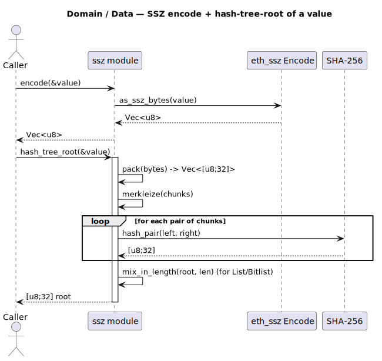

# Domain / Data Layer

Crates: `types`, `ssz`, `config`. The root of the dependency graph — pulls only
`core`/`std`/`alloc` plus serialization. No infrastructure dependencies.

## Class diagram

Source: [`domain-class.puml`](../diagrams/domain-class.puml).

- **`types`** — SSZ primitive types: `BasisPoint`, `ByteVector<N>` (aliased to
  `Bytes32` and `Bytes4000`), `ByteList`, `ByteListLimit<LIMIT>`,
  `Bitvector<N>`, `Bitlist<LIMIT>`, plus the `TypesError` enum and little-endian
  decode helpers.
- **`ssz`** — the `HashTreeRoot` trait, re-exported `Encode`/`Decode` traits,
  the `SszError` enum, and free functions for encoding, decoding, packing, and
  merkleization (`merkleize`, `merkleize_with_limit`, `merkleize_progressive`,
  `mix_in_length`, `mix_in_selector`).
- **`config`** — the `Config` struct (slot timing, basis-point cutoffs, registry
  limits), `ConfigError`, and the `DEVNET_CONFIG` constant.

## Sequence — SSZ encode + hash-tree-root

Source: [`domain-seq-htr.puml`](../diagrams/domain-seq-htr.puml).

Encoding delegates to the upstream `eth_ssz` `Encode` impl; hashing packs the
bytes into 32-byte chunks, merkleizes pairwise via SHA-256, and mixes in the
length for list/bitlist types.
