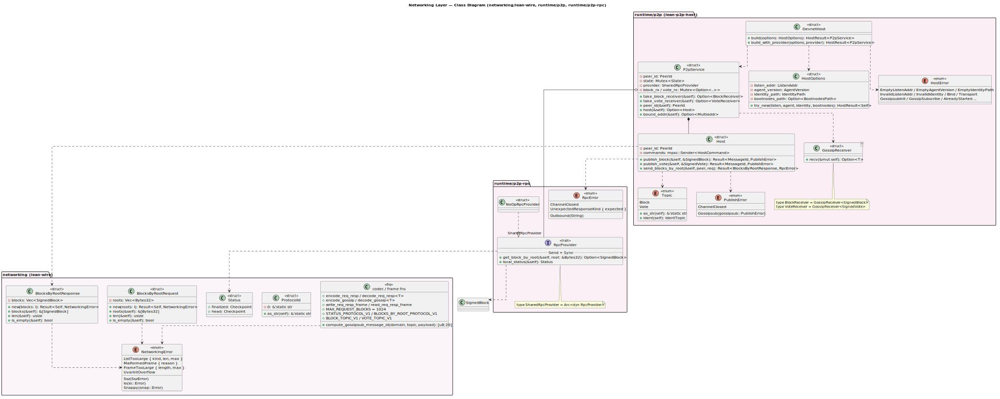
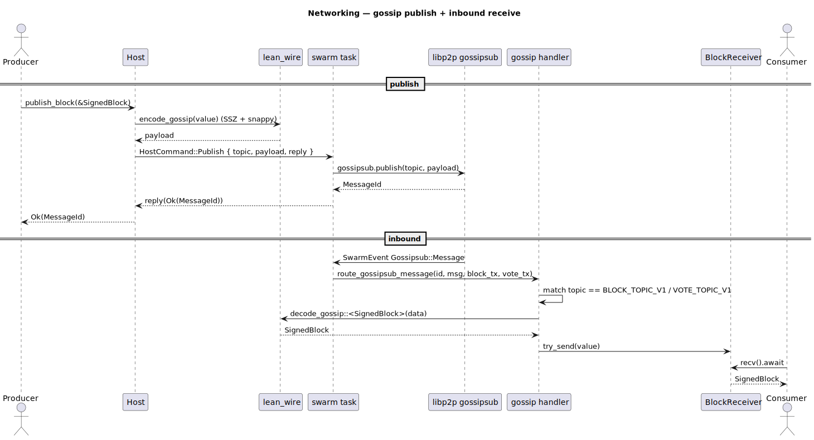
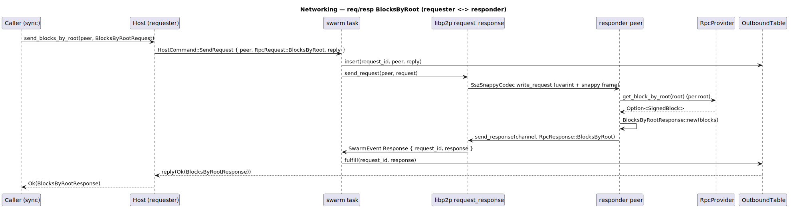

# Networking Layer

Crates: `networking` (lean-wire — wire messages + codecs), `runtime/p2p-rpc`
(RPC port), `runtime/p2p` (lean-p2p-host — libp2p host).

## Class diagram

Source: [`networking-class.puml`](../diagrams/networking-class.puml).

- **`networking` (lean-wire)** — wire messages `Status`,
  `BlocksByRootRequest`, `BlocksByRootResponse`; `ProtocolId`;
  `NetworkingError`; and SSZ+Snappy codec / framing helpers plus
  `compute_gossipsub_message_id`.
- **`runtime/p2p-rpc`** — the `RpcProvider` port (`get_block_by_root`,
  `local_status`), `NoOpRpcProvider`, `RpcError`, and `SharedRpcProvider`
  (`Arc<dyn RpcProvider>`).
- **`runtime/p2p` (lean-p2p-host)** — `DevnetHost` builder, `P2pService`
  (lifecycle service), `Host` handle (`publish_block`, `publish_vote`,
  `send_blocks_by_root`), `Topic`, `GossipReceiver<T>`
  (`BlockReceiver`/`VoteReceiver`), `HostOptions`, `PublishError`, `HostError`.

## Sequence — gossip publish + receive

Source: [`networking-seq-gossip.puml`](../diagrams/networking-seq-gossip.puml).

Publishing SSZ+Snappy-encodes the value and sends a `HostCommand::Publish` to
the swarm task; inbound messages are routed by topic and decoded into the
matching `GossipReceiver`.

## Sequence — req/resp BlocksByRoot

Source: [`networking-seq-blocksbyroot.puml`](../diagrams/networking-seq-blocksbyroot.puml).

The requester correlates the outbound request via `OutboundTable`; the responder
answers each root through the `RpcProvider` and sends a `BlocksByRootResponse`.
