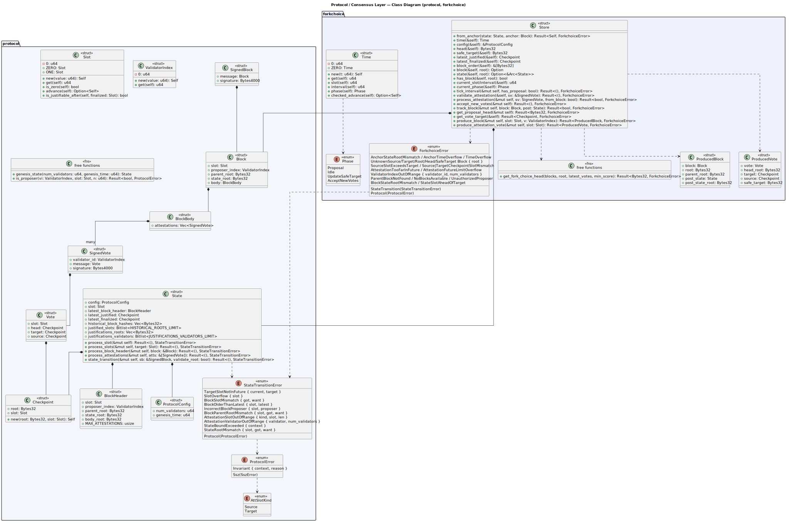
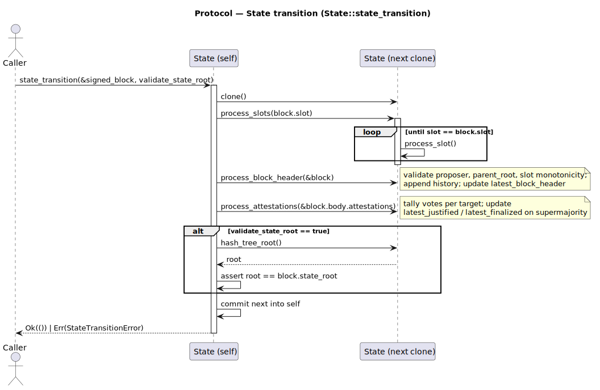
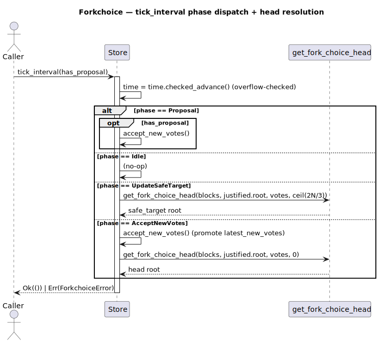

# Protocol / Consensus Layer

Crates: `protocol` (state-transition function), `forkchoice` (LMD-GHOST fork
choice). Builds directly on the domain layer.

> Post-quantum signatures are placeholders in this devnet: `signature` fields
> (`Bytes4000`) are carried but not yet verified. Verification and aggregation
> are future work.

## Class diagram

Source: [`protocol-class.puml`](../diagrams/protocol-class.puml).

- **`protocol`** — consensus value types (`Slot`, `ValidatorIndex`,
  `Checkpoint`, `Vote`, `SignedVote`, `BlockHeader`, `BlockBody`, `Block`,
  `SignedBlock`, `ProtocolConfig`) and the `State` aggregate with the
  state-transition entry points (`process_slot(s)`, `process_block_header`,
  `process_attestations`, `state_transition`). Errors: `ProtocolError`,
  `StateTransitionError`, `AttSlotKind`.
- **`forkchoice`** — `Time`/`Phase` interval model, the `Store` (block tree +
  vote tracking + block/attestation production), the `ProducedBlock` /
  `ProducedVote` outputs, `ForkchoiceError`, and the `get_fork_choice_head`
  LMD-GHOST walk.

## Sequence — state transition

Source: [`protocol-seq-stf.puml`](../diagrams/protocol-seq-stf.puml).

`state_transition` works on a clone, advances slots, applies the block header
and attestations, optionally validates the state root, then commits — so a
failure never mutates the original state.

## Sequence — fork choice tick

Source: [`protocol-seq-forkchoice.puml`](../diagrams/protocol-seq-forkchoice.puml).

`tick_interval` advances time and dispatches per `Phase`: the
`UpdateSafeTarget` and `AcceptNewVotes` phases run `get_fork_choice_head` with
different minimum-score thresholds.
