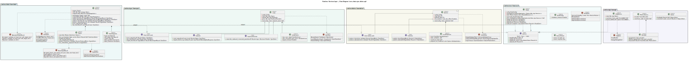
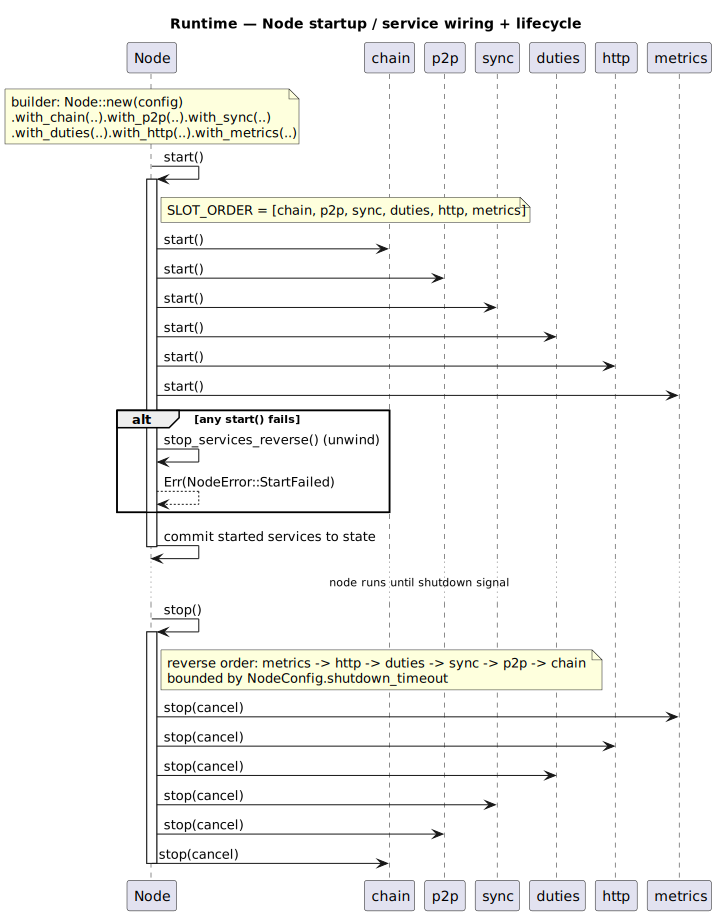
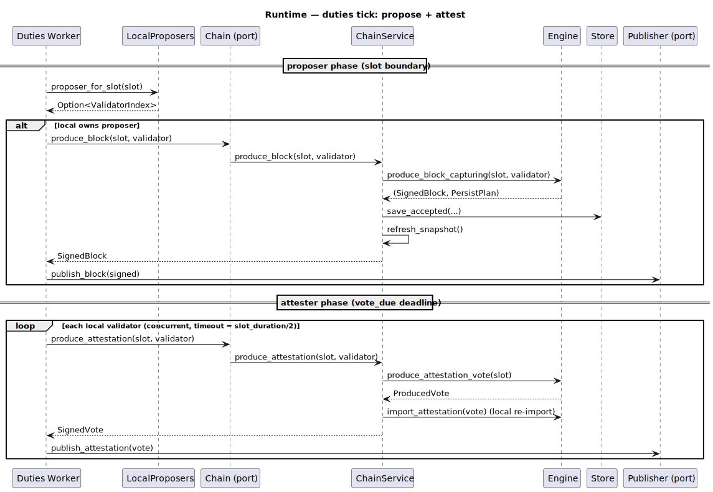
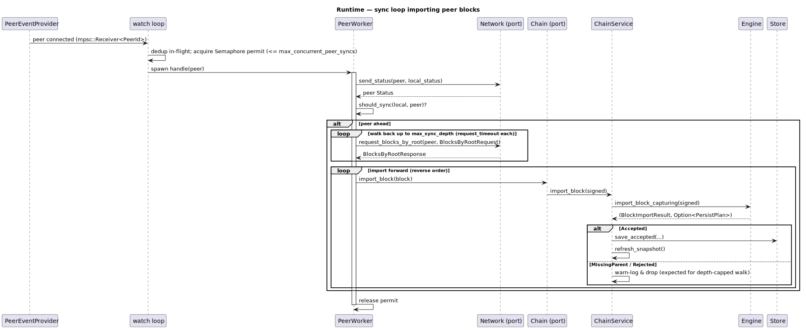

# Runtime / Services Layer

Crates: `runtime/core` (lean-core), `runtime/chain` (lean-chain), `runtime/sync`
(lean-sync), `runtime/duties` (lean-duties), `runtime/api` (lean-api). This is
the service layer that composes the lower layers into a running node.

The sync and duties crates define their own `Chain` **ports** (traits);
`lean-chain`'s `Service` is adapted to those ports in the consumer crates
(`chain_adapter.rs`), keeping `lean-chain` free of upward dependencies.

## Class diagram

Source: [`runtime-class.puml`](../diagrams/runtime-class.puml).

- **`runtime/core`** — the `Service` lifecycle trait and the `Node` container
  (builder `with_*` methods + `start`/`stop`/`status`/`run`), `NodeConfig`,
  `NodeError`, `ServiceFailure`.
- **`runtime/chain`** — `Service` (block/attestation import + production), the
  `Engine` (wraps `forkchoice::Store`), `ChainSnapshot`, `BlockImportResult`,
  `AttestationImportResult`, `EngineError`, `ChainError`.
- **`runtime/sync`** — the `Loop` service, `Chain`/`Network`/`PeerEventProvider`
  ports, `Config` (depth + concurrency + timeout), `SyncError`.
- **`runtime/duties`** — the generic `Service<C, P>`, `Chain`/`Publisher` ports,
  `LocalProposers`, `DutiesError`.
- **`runtime/api`** — `HttpService` (head endpoints over `Store`),
  `MetricsService`, `Server`, `Recorder`/`FrozenRecorder`, `HttpError`.

## Sequence — node startup / wiring

Source: [`runtime-seq-startup.puml`](../diagrams/runtime-seq-startup.puml).

`Node` starts services in `SLOT_ORDER` (chain → p2p → sync → duties → http →
metrics), unwinding in reverse on failure, and stops in reverse order bounded by
`shutdown_timeout`.

## Sequence — duties tick (propose + attest)

Source: [`runtime-seq-duties.puml`](../diagrams/runtime-seq-duties.puml).

If a local validator owns the slot proposer, the worker produces and publishes a
block; at the vote deadline it produces and publishes attestations per local
validator concurrently.

## Sequence — sync loop importing peer blocks

Source: [`runtime-seq-sync.puml`](../diagrams/runtime-seq-sync.puml).

Per connected peer, the loop exchanges status, walks back up to `max_sync_depth`
via `request_blocks_by_root`, then imports forward into the chain — concurrency
capped by a semaphore, each peer walk independently cancellable.
