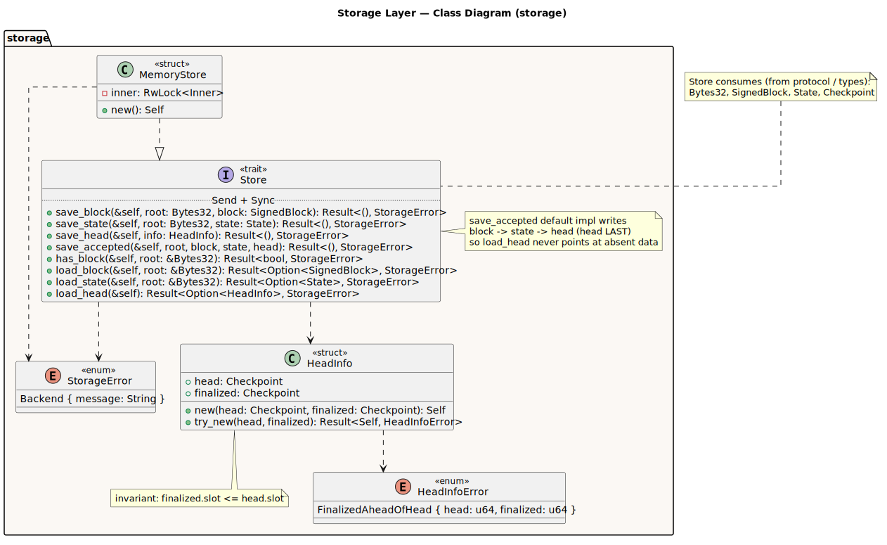
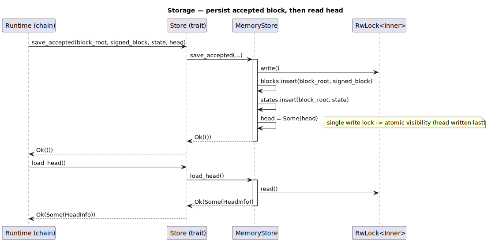

# Storage Layer

Crate: `storage`. A persistence port (`Store` trait) with an in-memory adapter
(`MemoryStore`). Consumes `protocol`/`types` values; depends on no other runtime
crate.

## Class diagram

Source: [`storage-class.puml`](../diagrams/storage-class.puml).

- **`Store`** (trait, `Send + Sync`) — `save_block`, `save_state`, `save_head`,
  `save_accepted`, `has_block`, `load_block`, `load_state`, `load_head`. The
  `save_accepted` default impl writes head **last** so `load_head` never points
  at absent block/state.
- **`MemoryStore`** — `RwLock<Inner>`-backed adapter; overrides `save_accepted`
  to write all three under a single write lock (atomic visibility).
- **`HeadInfo`** — `head`/`finalized` checkpoint pair, with the invariant
  `finalized.slot <= head.slot` (`HeadInfoError` on violation).
- **`StorageError`** — `Backend { message }`; reserved for fallible adapters
  (`MemoryStore` itself is infallible).

## Sequence — persist then read head

Source: [`storage-seq-persist.puml`](../diagrams/storage-seq-persist.puml).

`save_accepted` takes a single write lock across block + state + head; a later
`load_head` takes a read lock and returns the current checkpoint pair.
